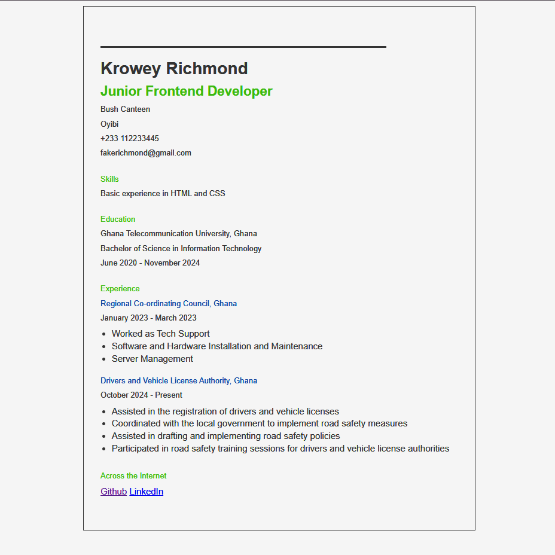

# Projects from Roadmap.sh

This repository features front-end projects developed by following the [roadmap.sh](https://roadmap.sh/) front-end developer path.

## Projects List

[Single-Page CV](https://roadmap.sh/projects/single-page-cv), [Minimal Blog Card](https://roadmap.sh/projects/minimal-blog-card),\
[Basic HTML Website](https://roadmap.sh/projects/basic-html-website), [Personal Portfolio](https://roadmap.sh/projects/portfolio-website),\
[Changelog Component](https://roadmap.sh/projects/changelog-component), [Testimonial Cards](https://roadmap.sh/projects/testimonial-cards),\
[Datepicker UI](https://roadmap.sh/projects/datepicker-ui), [Accessible Form UI](https://roadmap.sh/projects/accessible-form-ui),\
[Image Grid Layout](https://roadmap.sh/projects/image-grid), [Tooltip UI](https://roadmap.sh/projects/tooltip-ui),\
[Simple Tabs](https://roadmap.sh/projects/simple-tabs), [Cookie Consent](https://roadmap.sh/projects/cookie-consent),\
[Restricted Textarea](https://roadmap.sh/projects/restricted-textarea), [Accordion UI](https://roadmap.sh/projects/accordion),\
[Custom Dropdown](https://roadmap.sh/projects/custom-dropdown), [Task Tracker](https://roadmap.sh/projects/task-tracker-js),\
[Github Random Repo](https://roadmap.sh/projects/github-random-repo), [Reddit Client](https://roadmap.sh/projects/reddit-client),\
[Temperature Converter](https://roadmap.sh/projects/temperature-converter), [Age Calculator](https://roadmap.sh/projects/age-calculator),

Click any of the images below to view a live demo of the project.

    
    

## Acknowledgements

- [Roadmap.sh](https://roadmap.sh/frontend/projects) for project inspiration
- W3Schools for CSS references

This project was created as a submission to a [Roadmap.sh][def] challenge.

## Author

**Krowey Richmond Borquaye**

- GitHub: [Krowey Richmond Borquaye](https://github.com/krowey-richmond)
- X: [Kromo77](https://x.com/kromo772004)
- LinkedIn: [Krowey Richmond Borquaye](https://linkedin.com/in/krowey-richmond)
- Email: kroweyrichmond2004@gmail.com

## License

This project is licensed under the MIT License. See the LICENSE file for details.
